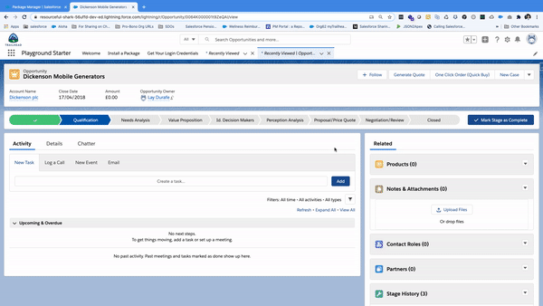
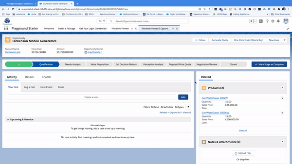

# Opportunity, Quote, Order Generation - One Click SFDC Superflows

## Executive Summary - Quick
This package allows you to generate automatically Orders from Opportunities and Quotes in Salesforce in simple 'one-clicks' using Lightning actions versus using standard OOTB related list generation functionality.

**Package Name**: Opportunity, Quote, Order Generation One Click Superflows

**Version Name**: Opportunity, Quote, Order Generation One Click Superflows

**Version Number**: 1.0

**Installation URL**: 
[https://login.salesforce.com/packaging/installPackage.apexp?p0=04t4K000002iidT](https://login.salesforce.com/packaging/installPackage.apexp?p0=04t4K000002iidT&isdtp=p1)

## Demo

**Generate Quote -> Process Order**

**One Click Order (Quick Buy)**

## Background / Problem - Detail
*Generate Orders (w/ Quotes)* - https://appexchange.salesforce.com/appxListingDetail?listingId=a0N3000000B5iwHEAR  - is an add-on AppExchange package which allows the automatic generation of orders from Opportunities or Quotes. 

The above package's latest release was on 9/23/2014. 

I used the the above mentioned package in a recent client engagement and found it suboptimal  - it is not straightforward configuration as expected and thus it would work sometimes, whilst fail at other times. Additionally, all of are autolaunched flows and thus provide no intuitive user experience upon record creation - there is no auto navigating to the newly created records.

Thus, I wanted to optimize this inefficiency by providing easier configuration for admins, and a more user friendly experience for end users.

## Resolution

In order to optimize this, and taking into account last release date was ~6 years ago; I've recreated the key components, excluding those involving the Contracts object, in a more optimal manner and up-to-date with all the niceties of Lightning Flow Builder. 

This can be easily installed using the following the unmanaged package.

**Opportunity, Quote, Order Generation One Click Superflows, Version 1.0**:
**https://login.salesforce.com/packaging/installPackage.apexp?p0=04t4K000002iidT&isdtp=p1**

*Note. This package is for orgs with standard Quotes enabled in Salesforce.*

## Installation and Configuration Steps

1. General - How to install packages in Salesforce:
https://trailhead.salesforce.com/content/learn/modules/trailhead_playground_management/install-apps-and-packages-in-your-trailhead-playground

2. Package Specific Configuration - You need to add the Generate Quote, Process Order and One-Click Order (Quick Buy) actions to the page layouts of respective object pages in order to run the flows.
  
## Package Contents

### Lightning Flows
| Component Name                         | Parent Object | Component Type |
| -------------------------------------- | ------------- | -------------- |
| Opportunity to Order                   |               | Flow Version   |
| Quote to Order                         |               | Flow Version   |
| Opportunity to Quote                   |               | Flow Version   |
| Opportunity to Quote - No Nav To Quote |               | Flow Version   |

### Aura Component Bundle
| Component Name   | Parent Object | Component Type        |
| ---------------- | ------------- | --------------------- |
| navigateToRecord |               | Aura Component Bundle |

### Lightning Object-Specific Actions
| Component Name              | Parent Object | Component Type |
| --------------------------- | ------------- | -------------- |
| Generate Quote              | Opportunity   | Action         |
| Process Order               | Quote         | Action         |
| One Click Order (Quick Buy) | Opportunity   | Action         |
